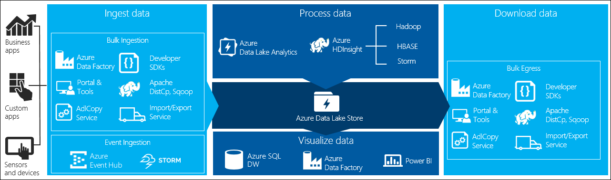

# Hello Data Lake World

This article provides an introduction to the concept of a **data lake**, and then makes the concept concrete by explaining how developers can implement solutions that use the *Azure Data Lake Store* service. It will clarify how Azure Data Lake Store is different from (and in some cases complimentary to) Azure Storage, the different requirements Azure Data Lake Store addresses, and then lists the many ways data stored in Azure Data Lake Store can be analyzed within Azure. 

## What is a Data Lake?
Before diving into specific Azure services, it is important to understand the conceptual definition of data lake. As enterprises have started to shift their perspective from only maintaining the current values of their transactional data, to taking a long term view and managing all their data as a valuable enterprise asset, a need for a storage repository that could handle these potentially enormous volumes of data, cope with their varying (or even missing) schemas, and support high ingest velocities. 

The term data lake was created by *James Dixon*, the CTO of Pentaho where he defined it by contrasting it against what the enterprise was currently using- the traditional and highly schematized data mart:

> "If you think of a datamart as a store of bottled water - cleansed and packaged and structured for  easy consumption - the data lake is a large body of water in a more natural state. The contents of  the lake stream in from a source to fill the lake, and various users of the lake can come to examine, dive in, or take samples."

From the developer’s perspective, the **data lake is the infinitely scalable store where the raw data lands** that can be programmed against using a myriad of tools to explore, organize, refine, aggregate, reformat and index so that applications can efficiently access whatever subset of the data they require. At the same time, the enterprise always has the rawest form of the assets just in case its needs the original data months or even years later. Once the raw data is processed, the data lake also becomes the source of truth for well-manicured data, enterprise wide. Typically, when we work with data in a data lake, they are performing batch processing where the programs are capable of handling the massive data sets and the time until results ready (e.g., the latency) is expected to be longer than the traditional database. For example, queries might take minutes to hours to run against a data lake running against petabytes of data instead of the seconds to minutes common in the transactional database world handling terabytes of data.

## What is the Azure Data Lake Store? (ADLS)
Azure Data Lake Store is a hyper-scale data repository optimized for analytics workloads—it provides a data lake, but as a managed service. The benefit of it being a managed service is that, as a developer, one gets a service that can easily scale from gigabytes to petabytes of data on demand, that automatically optimizes itself to support the throughput demands of the application. Developers are freed from the traditional concerns of storage clusters that surface when reaching scalability limits that ultimately force them to re-engineer how storage is used by the application such as by introducing sharding.

Azure Data Lake Store enables the storage of data in its native form (as some sort of file) in a hierarchical file system (e.g., trees of folders, subfolders and files). It provides very low latency read/write access and high throughput for scenarios like high-resolution video, scientific, medical, large backup data, event streams, web logs, and Internet of Things (IoT). 

Given that it is **designed to support analytics workloads** (e.g., think queries that involve aggregates likes averages or counts that need to operate on large swaths of the data), a key performance benefit is the support it provides for parallel reads. The Azure Data Lake Store automatically spreads parts of a file over a number of individual storage servers, which improves the read throughput as application can read the file in parallel from each of the servers for performing data analytics (e.g., each application process can work on different parts of the file at the same time). While some scalable storage solutions offer parallel read support, they usually do so at the expense of efficiently supporting small files—the files they work with need to be in the 64-256MB ranges. This means that developers whose applications work with small files need to concoct creative solutions to pack the small files into large files. Azure Data Lake Store handles high volumes of small writes at low latency, so it’s optimized for near real-time scenarios like website analytics, IoT, and analytics from sensors.

>As a developer of “big data” applications built within the Hadoop ecosystem, Azure Data Lake Store Azure Data Lake Store is an Apache Hadoop file system that’s compatible with Hadoop Distributed File System (HDFS) and therefore works within the Apache Hadoop ecosystem.

## Learning ADLS by Comparison to Azure Storage Blobs
If you are developer using Azure, you have probably used Azure Storage Blobs. It can be helpful to understand Azure Data Lake Store by comparing it to Azure Storage Blobs. The key capabilities that highlight their differing goals are:

* **Optimized for analytic workloads**. Azure Data Lake Store is specifically optimized to supports analytic workloads that need to read data in parallel, efficiently handles small writes. In contrast, Azure Storage Blobs is designed to provide a general purpose object store that can serve anything from small files to 1TB files that provide the backing store for virtual machine disks. Azure Data Lake Store is less ideal for “cold” or “cool” storage from a cost perspective (the cost per GB of files is slightly higher for Azure Data Lake Store than for LRS/ZRS Azure Storage Blobs, and I/O transactions cost roughly twice as much). Additionally, Azure Data Lake Store is not available for use as a disk backing store for virtual hard disks attached to virtual machines, and unlike Azure Storage Blobs, it is not accessible via network file shares (e.g., SMB).

* **No limits storage**. Azure Data Lake Store has no limits on all up account size, or file count limits, or per file size limits. It can handle petabyte sized files. Azure Storage Blobs has two noteworthy limits: a storage account hold at most 500 TB of data, and the individual files have size limits of their own (block blobs can be at most 195GB, and page blobs 1 TB).

* **Enterprise Grade Security**. Azure Data Lake Store provides a firewall for IP based restrictions on who is allowed to connect to the store. Additionally, it is integrated with Azure Active Directory for authentication and for authorization it provides role based access control (RBAC) with granular POSIX permissions (e.g., read, write, execute) at the folder and file levels. Data is encrypted in transit to/from the Azure Data Lake Store via TLS. Encryption at rest (e.g., transparent server-side encryption) is forthcoming. These stand in contrast to the approach taken by Azure Storage Blobs that use either a Storage Account Name/Key pair or a Shared Access Signature. Azure Storage Blobs offers support for transparent server side encryption of the blobs it stores.

* **Data Replication**. Data managed by Azure Data Lake Store is triple replicated within a datacenter just like Azure Storage, however geo-replication is still on the roadmap. 

## How do you use the Azure Data Lake Store?
You will typically be concerned with ingesting data into the store, exporting data from the store and processing data by reading directly from and writing directly to the store.

### Ingest & Export 
Getting data into and out of Azure Data Lake Store is a fundamental operation, and there are many ways to accomplish this data movement. If you have lots of data to ingest from an on-premises source, you can use the Azure Import/Export service. Here you load up and ship 6TB disks to Azure and upon receipt the contents are copied Azure Storage blobs. You can then use the Azure Data Lake Copy Service via the adlcopy command line executable to orchestrate the copying from Azure Storage Blobs to your Azure Data Lake Store. Even without shipping disks, if you already have data in Azure Storage Blobs, you can also use adlcopy to copy the data over. 

If you have streams of data that you wish to land in Azure Data Lake Store, you can use Azure Stream Analytics to pull the data from the source (which is likely to be a queue like Event Hubs or IoT Hub) and write out the messages to your store as files. 

Additionally, from within an SSH session to an HDInsight cluster you can use command line tools like Sqoop or DistCp to leverage the cluster resources to move data.

More complex data movements can be orchestrated using Azure Data Factory. For example, you can use Azure Data Factory to load files from and on-premises network share or query database such as Oracle or Teradata and write the results as files in the Azure Data Lake Store. Of course, if you only have a handful of files you need to upload on an ad-hoc basis to Azure Data Lake Store, you could use the Data Explorer feature available from the blade your Azure Data Lake Store in the Azure Portal to browse, create folders, and upload files. 

Most of these options have parallel features for getting data out of your Data Lake Store, as illustrated in the diagram. 

 

However, you are most likely also interested in how you interact with data in the Azure Data Lake Store file system programmatically. At a high level, there are two ways to accomplish this- you can use the RESTful Web HDFS API or you can use the language specific SDK’s. Currently, SDK’s are available for .NET, Java and node.js. Any of these approaches let you work with the file system:
* List files and folders
* Retrieve file content
* Create folders
* Upload new files and append content to existing files
* Rename and Delete files

### Process data stored in Azure Data Lake Store 
Unless you are planning to build your own big data analytics engine, you are unlikely to use the Azure Data Lake API’s directly for anything beyond ingest and export of data. When it comes time to build analytics solutions for your application you will typically choose from the following services and applications:

* **HDInsight**. HDInsight provides a Hadoop distribution running on a cluster as a managed service. This enables you to run applications that perform distributed computation cross the cluster. These application can be built with R (using R Server on Spark or R Server on Hadoop), Spark, Hive, Pig, MapReduce, HBase, or Hadoop MapReduce.  
* **SQL Data Warehouse**. With SQL Data Warehouse you can create external tables that apply a schema on read to the files managed by your Azure Data Lake Store. The result is a table you can query using SQL. This leverages the PolyBase feature of SQL Data Warehouse, and enables you to join the unstructured, semi-structure or structured data living as files in your Data Lake Store with the structured data maintained in more traditional tables whose storage is managed by SQL Data Warehouse itself (and is ultimately persisted in Azure Premium Storage).
* **Azure Data Lake Analytics**. You can leverage Azure Data Lake Analytics to author distributed batch processing applications against the data managed by Azure Data Lake Store without having to worry about maintaining a cluster, being able to program the application using a familiar syntax that is a blend of SQL and C#, and not having to explicitly program how the application is parallelized because Azure Data Lake Analytics takes care of that for you.

## Done with the theory?
Check the [lab](scripts/lab.md)

 
