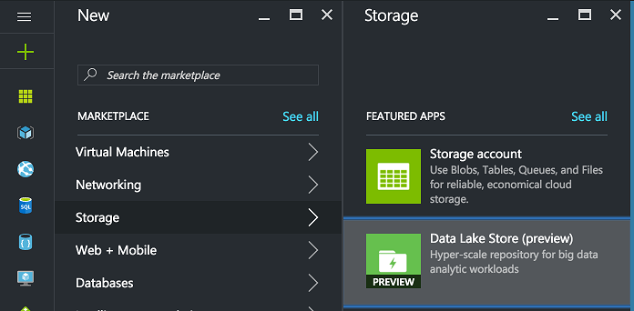
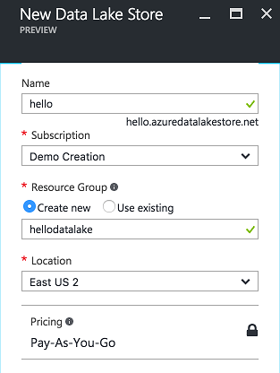
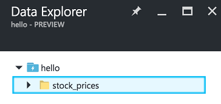

# Lab: Hello world using Data Lake 
 
In the lab you will complete a simple console application that interacts with a file stored by Azure Data Lake Store. The application will connect and upload information to the data lake, on a follow-up article we will see how to analyze that data.

## Requirements
* An [Azure Subscription](http://www.azure.com). It's ok with the free one.
* [Visual Studio 2015 Community](http://www.visualstudio.com) Edition or higher
* The [Azure SDK](https://azure.microsoft.com/en-us/downloads/). There are several options(.NET, Java, Node.js, PHP...), but on this sample we're going to use the .NET one
* Follow these steps to provision a Data Lake Store Account:
  1.	Login to the [Azure Portal](https://portal.azure.com).
  2.	Select + New, Storage and then Data Lake Store.
  
  3.	Provide a name for the Data Lake Store.
  
  4.	Choose a Subscription and create a new resource group or select an existing one.
  5.	Select Create to provision the Data Lake Store.
  6.	Your Data Lake Store should be ready within a minute or two.

## Create a  Data Lake Client Application
Next, you will complete a console application that uses the Azure Data Lake Store SDK to list the files within a folder, upload a file and then download the uploaded file.

1.	Download the starter application from http://bit.ly/2fb2RH4 
2.	Using Visual Studio 2016, open HelloDataLake.sln.
3.	In Solution Explorer, expand the HelloDataLakeClient project and open Program.cs.
4.	Do not worry about any compile errors you see just yet, you will complete the code and the errors will go away.
5.	In program.cs scroll down to TODO: 1 and provide the name of you Azure Data Lake Store Account

```
// TODO: 1. Provide the name of your existing Data Lake Store account.
_adlsAccountName = "hello";
```

6.	For TODO: 2, replace the value with your Azure Subscription ID.

```
// TODO: 1. Replace with the subscription ID of the Azure Subscription containing your Data Lake Store account.
_subId = "e223f1b3-d19b-4cfa-98e9-bc9be62717bc";
```

7.	For TODO: 3., use the Azure Data Lake Store SDK to create a new file system object, by replacing the TODO 3: with the following:

```
// TODO: 3. Create file system client object 
_adlsFileSystemClient = new DataLakeStoreFileSystemManagementClient(creds);
```

8.	Next, locate TODO: 4. Here you will configure the display of a login dialog to acquire the credentials from the user running the console application that should be used to access the Data Lake Store.
9.	Replace TODO: 4 with the following:

```
//TODO: 4. Display the dialog to prompt user login
var creds = UserTokenProvider.LoginWithPromptAsync(domain, activeDirectoryClientSettings).Result;
```

10.	Locate TODO: 5 Here you will configure the file upload.
11.	Replace TODO: 5 with the following:

```
//TODO: 5. Configure the file upload
var parameters = new UploadParameters(srcFilePath, destFilePath, _adlsAccountName, isOverwrite: force);
var frontend = new DataLakeStoreFrontEndAdapter(_adlsAccountName, _adlsFileSystemClient);
var uploader = new DataLakeStoreUploader(parameters, frontend);
```

12.	Locate TODO: 6. Completing this line will perform the file upload as previously configured. 

```
//TODO: 6. Upload the file
uploader.Execute();
```

13.	Locate TODO: 7. Complete this line to retrieve the list of files present under the provided directory in Azure Data Lake Store.
14.	Replace TODO: 7 with the following:

```
//TODO: 7. Retrieve the list of files under the provided folder.
return _adlsFileSystemClient.FileSystem.ListFileStatus(_adlsAccountName, directoryPath).FileStatuses.FileStatus.ToList();
```

15.	Locate TODO: 8. Complete this line to open a stream to the file stored in Azure Data Lake Store.
16.	Replace TODO: 8 with the following:

```
//TODO: 8. Open a stream to the file in Azure Data Lake Store
var stream = _adlsFileSystemClient.FileSystem.Open(_adlsAccountName, srcPath);
```

17.	Locate TODO: 9. Complete these lines to save the stream to a local file.
18.	Replace TODO: 9 with the following:

```
//TODO: 9. Copy the stream to a local file
var fileStream = new FileStream(destPath, FileMode.Create);
stream.CopyTo(fileStream);
```

19.	Build the project and make sure it is error free.
20.	From the Debug menu, select Start without debugging.
21.	You will be prompted to login. Provide the same credentials you used to access the Azure Portal when you created your Azure Data Lake Store Account.
22.	The application should run and you should see output similar to the following:


23.	Login to the Azure Portal and navigate to the blade for your Data Lake Store Account.
24.	Select Data Explorer from the command bar at the top.
 


25.	In the tree, select stock_prices to see the contents of the folder.
 


26.	Verify that the csv file you uploaded is present.
 


**Congratulations!** you’ve programmatically managed the Azure Data Lake Store filesystem by using the .NET SDK and verified the result using Data Explorer.

## Resources
Check these links if you want to continue learning:
* link
* link
* link
