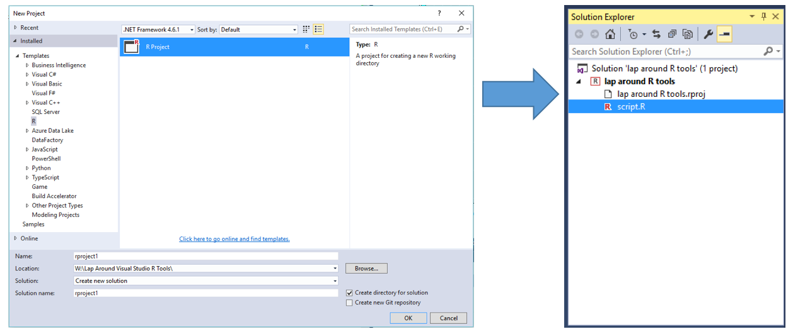
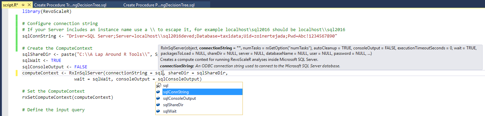
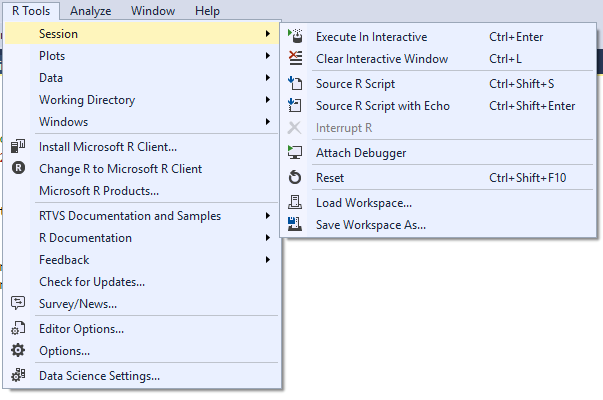
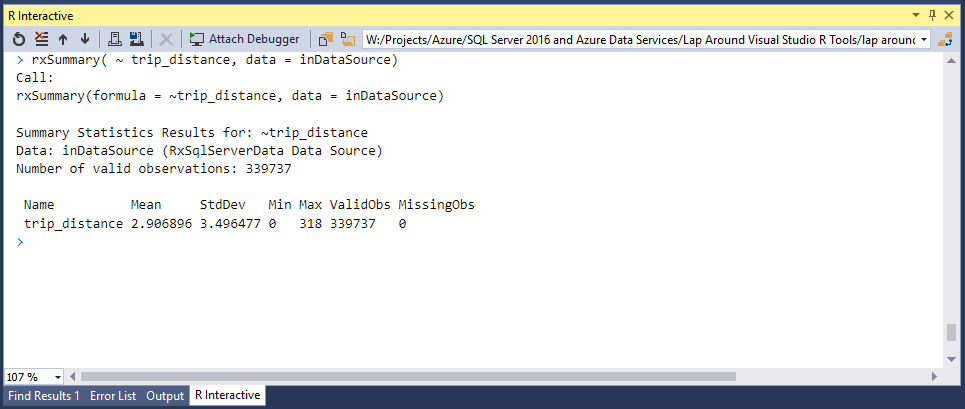
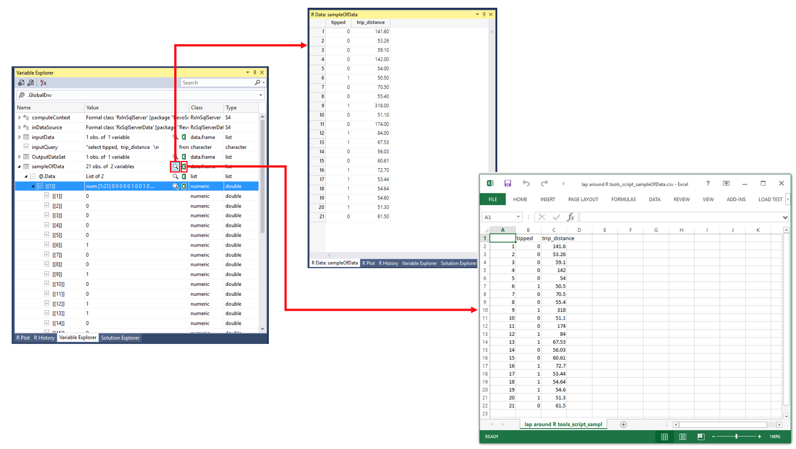
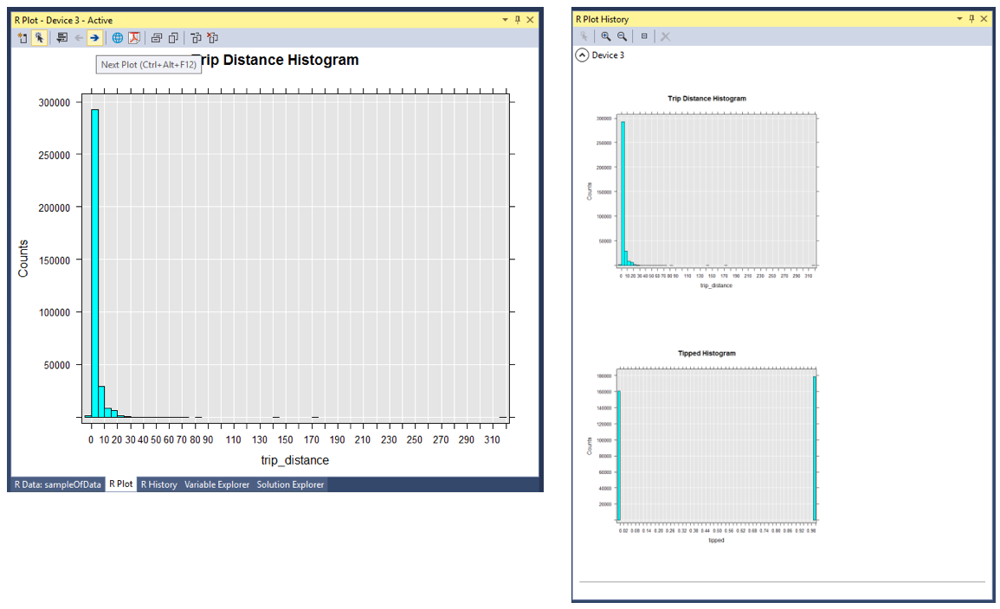

# Lap Around R Tools for Visual Studio

This article will provide developers a tour of the R Tools for Visual Studio Tools, providing context for both performing analysis locally within Visual Studio and in server/cloud environments, particularly using SQL Server R Services.

## Introducing R Tools for Visual Studio
R Tools for Visual Studio (RTVS) provides an add-on for any edition of Visual Studio 2015 (Community, Professional or Enterprise) that augments Visual Studio with support for the development, debugging and execution of R scripts. Let’s walk briefly thru the key features—the lab that accompanies this document will let you get hands one with many of them. 

### R as a first class citizen
With RTVS, developing R based applications become a **first class workload** within Visual Studio that’s on par with its support for C#, Visual Basic .NET and C++. You can create new R projects from the File-> New->Project menu, whose content you can manage from within Solution explorer, just as you would any other project in Visual Studio.   

**R scripts** themselves (e.g., text files saved with the .R extension) can be logically grouped into projects, and opening an R file will load the R script into a document editor window that includes support for **Intellisense** (statement completion of R syntax) as well as for easy bulk formatting of the selected code or all of the code present in the script file.

 

If you are familiar with developing in R in other environments, you are familiar with the notion of Workspaces which manage the in-memory state of your script execution, such as the values of current variables. These workspaces can be reset (so you can run your script from scratch), saved and loaded (so you can resume working where you left off). All of these options appear just off of the R Tools top level menu item that becomes available when you install RTVS.

Since most R development workloads are iterative and interactive, RTVS includes the **R Interactive Window** which provides you a REPL (read-eval-print) environment to execute R commands in a command line like environment. You can execute commands directly by typing them into the R Window and pressing the enter key, or you can select snippets of R script from an R editor you have open and press Control + Enter to have the selection executed in the R Interactive Window. The R Interactive Window also lets you kick off a **debugging session** (by selecting Attach Debugger) that enables you step thru any of you R script files line by line, inspect the values of variables and set and hit breakpoints.

As you execute your script code thru the R Interactive window, and variables you declare will be visible (along with their current values) from the Variable Explorer Window. With Variable Explorer you can drill into the value of complex objects, as well as visualize data frames using a tabular formatting provided by Data Explorer. If you have Excel installed, you can also choose to open the value of a variable in Excel for further analysis. 

RTVS also provides full support for **viewing R plots within Visual Studio** using the R Plots Window- so you can view your graphical charts, plots, graphs and visualizations without leaving Visual Studio. You save them as a PNG, JPEG, BMP or TIFF images or as a PDF file. **The R Plots Window supports plot history** (where one plot window is replaced with any new plot commands, but you can navigate back to your previous plots just like you would when pressing the back button in the browser to navigate to a previous web page in your browser’s history). It also supports having multiple plot windows open at the same time, so you can view plots side by side when making comparisons.

Finally, RTVS includes features you would expect from Visual Studio when developing in other languages. You can manage the dependencies of your R scripts by using the R Package Manager (in the same way you might manage NuGet packages).  You can also interact with Git and GitHub for maintaining your R project and its related assets in source control.

## Done with the intro?
[Start the lab!](LabandScripts/Lab.md)
