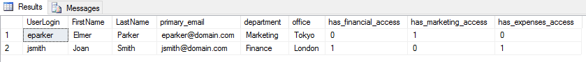
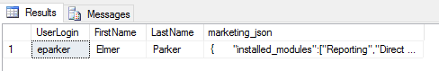
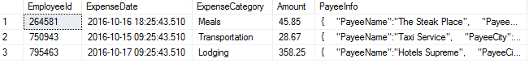
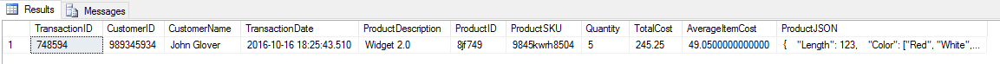
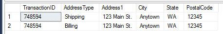

# Lab: JSON DB Support 
So you are ready to check out the new JSON support for yourself? This lab guide will walk you through the accompanying script. There are no requirements to run these scripts other than having a SQL instance with support for JSON. We will go through a lifecycle of building some database objects with JSON to support our application development efforts. Along the way we will demonstrate some of the powerful functions that support JSON in SQL Server. 

## Requirements
You'd need to use SQL Server 2016 or higher, let me share few options below
* Docker images
  - [Linux](https://hub.docker.com/r/microsoft/mssql-server-linux/)
  - [Windows](https://hub.docker.com/r/microsoft/mssql-server-windows/) 
  
* Native packages 
  - Free SQL Server 2016 Developer edition [installer for Windows](http://go.microsoft.com/fwlink/?LinkID=799009)
  - Free SQL Server vNext CTPs [for Linux](https://docs.microsoft.com/en-us/sql/linux/sql-server-linux-setup)
    
## Example Use Cases 
We will go through a few example use case in this lab to demonstrate the power and flexibility of JSON support within SQL Server. 

## Step 1: Create our Tables 
As we discussed in the article our JSON column is nothing more than  
```
CREATE TABLE [dbo].[UserProfile] 
( 
 [UserId] [uniqueidentifier] DEFAULT(NEWID()) PRIMARY KEY, 
 [UserLogin] [varchar](100) NOT NULL, 
 [FirstName] [varchar](100) NOT NULL, 
 [LastName] [varchar](100) NOT NULL, 
 [UserSettings] [NVARCHAR](max) NULL 
) 
GO 
 
CREATE TABLE [dbo].[OrderTransaction]( 
 [TransactionID] [int] NULL, 
 [CustomerID] [int] NULL, 
 [CustomerName] [varchar](255) NULL, 
 [TransactionDate] [datetime] NULL, 
 [ProductDescription] [varchar](255) NULL, 
 [ProductID] [varchar](255) NULL, 
 [ProductSKU] [varchar](255) NULL, 
 [Quantity] [int] NULL, 
 [TotalCost] [decimal](18, 2) NULL, 
 [AverageItemCost] [decimal](18,2) NULL, 
 [ProductJSON] [nvarchar](max) NULL 
)  
GO 
 
CREATE TABLE [dbo].[OrderAddress]( 
 [TransactionID] [int] NULL, 
 [AddressType] [varchar](255) NULL, 
 [Address1] [varchar](255) NULL, 
 [City] [varchar](255) NULL, 
 [State] [varchar](255) NULL, 
 [PostalCode] [varchar](255) NULL 
) 
GO 
 
 
CREATE TABLE [dbo].[ExpenseTransaction]( 
 [EmployeeId] [int] NULL, 
 [ExpenseDate] [datetime] NULL, 
 [ExpenseCategory] [varchar](255) NULL, 
 [Amount] [decimal](18,2) NULL, 
 [PayeeInfo] [nvarchar](max) NULL 
) 
GO 
```

## Step 2: Create some User Profiles 
```
Insert Into dbo.UserProfile (UserId, UserLogin, FirstName, LastName, UserSettings) 
 VALUES(NEWID(), 'jsmith', 'Joan', 'Smith', '{ 
 "department":"Finance", 
 "office":"London", 
 "email":["jsmith@domain.com","joan.smith@domain.com"], 
 "applications": 
   { 
    "application_financial":{ 
     "security_group":"administrators", 
     "display_name":"Joan S.", 
     "has_access":"True" 
    }, 
    "application_expenses":{ 
     "approval_departments":["Finance","Accounting","Tax"], 
     "approval_limit":15000, 
     "has_access":"True" 
    } 
   } 
}'), 
(NEWID(), 'eparker', 'Elmer', 'Parker','{ 
 "department":"Marketing", 
 "office":"Tokyo", 
 "email":["eparker@domain.com","elmer.parker@domain.com","marketing@domain.com"], 
 "applications": 
   { 
    "application_marketing":{ 
     "installed_modules":["Reporting","Direct Mail","Social Marketing"], 
     "email_enabled":"True", 
     "export_data_enabled":"False", 
     "has_access":"True" 
    }, 
    "application_expenses":{ 
     "approval_departments":["Marketing"], 
     "spending_limit":5000, 
     "approval_limit":2500, 
     "has_access":"False" 
    } 
   } 
}') 
```

Some key things to note with this data is that the properties that are present for each of the users is slightly different. For example, the applications that they have access to are different. Joan is setup for the financial and expense applications whereas Elmer has access to the marketing and expense applications. Some properties are different as well. Note that Elmer has a spending limit in the expense application and Joan does not. 

## Step 3: Returning a list of all users and systems they have access to 
In this query we are using *JSON_VALUE* in a couple different ways to show that we can use the return from the function anywhere we would use a scalar value. We can also return these scalar right alongside our non-JSON Data. We can also use the return from JSON_VALUE in aggregate functions, Where clauses, Sorts. Anything that is expecting a scalar value. 
```
Select 
 UserLogin, FirstName, LastName,  
 JSON_VALUE(UserSettings, '$.email[0]') as primary_email, 
 JSON_VALUE(UserSettings, '$.department') as department, 
 JSON_VALUE(UserSettings, '$.office') as office, 
 CAST(ISNULL(JSON_VALUE(UserSettings, '$.applications.application_financial.has_access'),0) as bit) as has_financial_access, 
 CAST(ISNULL(JSON_VALUE(UserSettings, '$.applications.application_marketing.has_access'),0) as bit) as has_marketing_access, 
 CAST(ISNULL(JSON_VALUE(UserSettings, '$.applications.application_expenses.has_access'),0) as bit) as has_expenses_access 
From  
 dbo.UserProfile 
```

There are a few things to mention for this query in how we query JSON data. The first thing to note is that if a property is not found the function will return NULL if we are running in the default lax mode. If we were running in strict mode an error would be returned. Since we want to always return a value we will check for NULL values. Secondly, the return data type from JSON_VALUE is always NVARCHAR, so we will do a conversion here to return as a bit data type instead. Lastly, we have a few different examples of path statements to find different properties in the document whether they are root properties, a value in an array or a property nested in the document. 
Here are the results from our query: 


 
 
## Step 4: Returning the Marketing settings for a user 
The marketing application supports JSON in their application so they would like to get their profile data back in JSON Format. To return a block of JSON we would instead use the *JSON_QUERY* function instead of the *JSON_VALUE* function to return a scalar value. 

```
Select 
    UserLogin, FirstName, LastName,  
 JSON_QUERY(UserSettings, '$.applications.application_marketing') as marketing_json 
From  
 dbo.UserProfile 
Where  
 UserLogin = 'eparker' 
```

They can now bring their profile settings into their application and parse the JSON. 
Here are the results from our query: 


 
 
### Step 5: Updating settings in the JSON 
Since our applications will change over time, we definitely have to support the ability of the applications to make changes to the application settings for users.  For that, we turn to *JSON_MODIFY*.  
The first scenario is the updating of a single value in the JSON document.  As an example in the expense application we want to update the spending limits of both users 
In the first example, we are setting an existing value to a new value. 

```
-- Updating a single scalar value 
Update dbo.UserProfile 
 Set UserSettings = JSON_MODIFY(UserSettings,'$.applications.application_expenses.spending_limit', CAST('6000' as int)) 
 Where UserLogin = 'eparker' 
```
In this second example, this user did not have a spending limit set. Since the path is not found a new property is added to the document at that path. When you pass a new value to the JSON_MODIFY function it assumes the data is NVARCHAR. Because we want our limit to be recognized as a number we ensure we cast to a numeric type (integer in our case), 
```
-- Updating a scalar value that does not exist 
Update dbo.UserProfile 
 Set UserSettings = JSON_MODIFY(UserSettings,'$.applications.application_expenses.spending_limit', CAST('100000' as int)) 
 Where UserLogin = 'jsmith' 
```
If we are adding values to an array, we can simply use the append operator to add a value to the end of the array. 
```
-- Adding a value to an array 
Update dbo.UserProfile 
 Set UserSettings = JSON_MODIFY(UserSettings, 'append$.email','finance@domain.com') 
 Where UserLogin = 'jsmith' 
```
If we want to make updates that require us to add blocks of JSON instead of single values we still use the JSON_MODIFY function, but we will be passing the block of JSON to be updated at the path instead of a single value. In this scenario, we want the JSON_MODIFY function to understand we are updating JSON so we surround the JSON in a JSON_QUERY function call. 
```
-- Adding a block of JSON 
Update dbo.UserProfile 
 Set UserSettings = JSON_MODIFY(UserSettings,'$.applications.application_marketing.social_settings',  
 JSON_QUERY('{"facebook_url":"www.facebook.com/myurl","linkedin_url":"www.linkedin.com/myurl","twitter_handle":"myhandle"}')) 
 Where UserLogin = 'eparker' 
```
 
## Step 6: Parsing JSON Documents into Tables 
As we are building our integrations with other systems, we are getting JSON documents from them that contain the data that we want to load into our systems. To handle going from JSON documents to a table structure we will be utilizing the powers of the OPENJSON function. We will go through a few examples to show the power and versatility of this function. The return value from the function is a table object which means we can do anything with the return that we would with an actual physical table. 

### Basic JSON Document 
In this example, we are getting a fairly basic file from one our services we use to manage our expenses. This would be an example of maybe a file we are getting delivered each day with the contents of our expenses logged for the day. 
```
DECLARE @json_expenses nvarchar(max) 
 
 Set @json_expenses = '[{ 
 "EmployeeID": 264581, 
 "ExpenseDate": "2016-10-16T18:25:43.511Z", 
 "Category": "Meals", 
 "Amount": 45.85, 
 "Payee":{ 
   "PayeeName":"The Steak Place", 
   "PayeeCity":"New York", 
   "PayeeState":"NY" 
   } 
}, { 
 "EmployeeID": 750943, 
 "ExpenseDate": "2016-10-15T09:25:43.511Z", 
 "Category": "Transportation", 
 "Amount": 28.67, 
 "Payee":{ 
   "PayeeName":"Taxi Service", 
   "PayeeCity":"San Francisco", 
   "PayeeState":"CA" 
   } 
},{ 
 "EmployeeID": 795463, 
 "ExpenseDate": "2016-10-17T09:25:43.511Z", 
 "Category": "Lodging", 
 "Amount": 358.25, 
 "Payee":{ 
   "PayeeName":"Hotels Supreme", 
   "PayeeCity":"Seattle", 
   "PayeeState":"WA" 
   } 
}]' 
 
Insert Into dbo.ExpenseTransaction(EmployeeId, ExpenseDate, ExpenseCategory, Amount, PayeeInfo) 
Select * From  
 OPENJSON(@json_expenses, '$') 
 WITH ( 
   EmployeeID int, 
   ExpenseDate datetime, 
   ExpenseCategory varchar(255) '$.Category', 
   Amount decimal(18,2), 
   PayeeInfo nvarchar(max) '$.Payee' as JSON 
  ) 
```

Now, we can just write a simple select statement to pull our data from our table. 
```
Select 
 * 
From dbo.ExpenseTransaction 
```
And the results of our query: 


 
By default, the function will look for fields at the root of the JSON Document, so although we specified the path '$' in our function it is optional unless you are pulling fields at a different level of the document as we will see later.  It will also match on your column name to the names of fields in the document. If there is not a direct match in the document, you need to provide a path to the field in the document as we did in the example of our Expense Category field. 
### Parsing a Complex JSON Document 
We looked at the simple example, but rarely are things that simple.  In our more complicated example, we are getting order transactions from our order tracking platform and we need to store them.  As you can see below we have quite a few things going on in this single document and we need to use OPENJSON to make this a reality. 
Here is our document that we are receiving 
```
DECLARE @json_trans nvarchar(max) 
 
 SET @json_trans = '{ 
 "TransactionID":"748594", 
 "CustomerID":"989345934", 
 "CustomerName":"John Glover", 
 "TransactionDate":"2016-10-16T18:25:43.511Z", 
 "ProductName":"Widget 2.0", 
 "ProductCode":{"ProductID":"8jf749","ProductSKU":"9845kwrh8504"}, 
 "Quantity": 5, 
 "TotalCost": 245.25, 
 "Address": [{ 
  "AddressType": "Shipping", 
  "StreetAddress": "123 Main St.", 
  "City": "Anytown", 
  "State": "WA", 
  "PostalCode": "12345" 
 }, { 
  "AddressType": "Billing", 
  "StreetAddress": "123 Main St.", 
  "City": "Anytown", 
  "State": "WA", 
  "PostalCode": "12345" 
 }], 
 "ProductOptions": { 
  "Length": 123, 
  "Color": ["Red", "White", "Purple"], 
  "Width": 10 
 } 
}' 
```
 
There are a couple of different ways that we could handle this document. In our system we want to break this single document into a couple different tables – One for the order itself and then the second to store the addresses for our orders. 
First, let’s look at the query for our orders 
```
Select  
 TransactionID, CustomerID, CustomerName, TransactionDate, ProductDescription,  
 ProductID, ProductSKU, Quantity, TotalCost,  
 -- We can add calculations just like we would in a Select from a Table 
 (TotalCost/Quantity) as AverageItemCost,  
 ProductJSON 
From 
 OPENJSON(@json_trans) 
 WITH 
  ( 
   TransactionID int, 
   CustomerID int, 
   CustomerName varchar(255), 
   TransactionDate datetime, 
   ProductDescription varchar(255) '$.ProductName', 
   -- ProductID and ProductSKU are nested so we need to 
   -- provide a path to the sub-document 
   ProductID varchar(255) '$.ProductCode.ProductID', 
   ProductSKU varchar(255) '$.ProductCode.ProductSKU', 
   Quantity int, 
   TotalCost decimal(18,2), 
   -- We need to specify AS JSON anytime we are returning a JSON object 
   ProductJSON nvarchar(max) '$.ProductOptions' AS JSON 
  ) 
```
 
Here are the results from our query: 


 
 
In the query we noted some of the key takeaways from this query.  But, just as in our basic example above we can now do anything with this dataset that we could with a regular table. 
 
Now let’s take a look at our OPENJSON query to get the Addresses 

''' 
Select ord.TransactionID, addr.*  
From  
 -- We want to get the array of addresses so are path pulls the value  
 -- for the Address property 
 OPENJSON(@json_trans, '$.Address') 
WITH 
 ( 
  AddressType varchar(255), 
  Address1 varchar(255) '$.StreetAddress', 
  City varchar(255), 
  [State] varchar(255), 
  PostalCode varchar(255) 
 ) as addr 
CROSS APPLY  
 -- We cross apply with the order so we can store the Transaction ID with each address 
 -- This will be a common pattern we can use to deal with more complex documents. 
 OPENJSON(@json_trans) 
 WITH (TransactionID int) as ord 
 '''

Now we can look at our results 



 
 
## Step 7: Returning JSON Data with FOR XML 
There are many benefits to storing our data in relational tables, but we often have to share that data with other systems as JSON is a great way to do that. To accomplish that, we can use the FOR XML statement in SQL Server to convert our relational data to JSON documents. 
Using FOR XML AUTO 
In this first example we need to provide an export of our User Settings table to other systems so they can provide access to those users to the various systems. We may need to do this because 
we have systems that are not completely integrated so user profiles need to be synced. This example is using the AUTO option of the FOR JSON clause. The AUTO option is great when you want simple documents with elements all at the root element. 

```
Select  
  UserId, 
  UserLogin as login, 
  FirstName as fname, 
  LastName as lname, 
  JSON_QUERY(UserSettings) as Settings 
 From  
 dbo.UserProfile 
 FOR JSON AUTO, ROOT('UserProfiles') 
```
Some other attributes of the query to point out is that we are using the optional ROOT clause which allows us to specify a named root node. Also, since our UserSettings column contains JSON data, we need to surround it with JSON_QUERY to ensure that SQL Server sees this as JSON text. Lastly, note that the names for the properties in the document are driven by the name of the column returned. 
### Using FOR XML PATH 
Since we need to interface and send data to multiple systems, we can use FOR JSON to provide all types of formats of JSON documents. By using the PATH option in the FOR JSON clause we have control to create documents with more complex structures than the AUTO option give us. The PATH option will inspect the column names and build nested properties based the “.” notation in the column names. 

```
Select 
 ot.TransactionID, 
 ot.TransactionDate, 
 ot.ProductID as [ProductInfo.ProductID], 
 ot.ProductSKU as [ProductInfo.ProductDetails.ProductSKU], 
 ot.ProductDescription as [ProductInfo.ProductDetails.ProductDescription], 
 oas.Address1 as ShippingAddress, 
 oas.City + ', ' + oas.[State] + ' ' + oas.PostalCode as ShippingCityStatePostal, 
 oab.Address1 as BillingAddress, 
 oab.City + ', ' + oab.[State] + ' ' + oab.PostalCode as BillingCityStatePostal 
From 
 dbo.OrderTransaction ot 
Left Outer Join dbo.OrderAddress oas 
 On ot.TransactionID = oas.TransactionID 
  And oas.AddressType = 'Shipping' 
Left Outer Join dbo.OrderAddress oab 
 on ot.TransactionID = oab.TransactionID 
  And oab.AddressType = 'Billing' 
FOR JSON PATH 
```
Using FOR XML gives you the power and flexibility to generate a variety of JSON documents from any data in your database 

## Step 8: Indexing 
We all know and love indexes and know how much they can positively impact our performance when properly applied. JSON documents cannot be directly indexed, however, we can use computed columns to make columns in our JSON document available for indexes. 
For example, we want to be able to query our expense table by some of the columns that are stored in the PayeeInfo column, namely the State.  So we will create a computed column and then create an index based on that column. We could include any other columns in the index or include columns for performance  

```
-- We will add a computed column that pulls the property from our document 
 ALTER TABLE dbo.ExpenseTransaction 
 ADD vPayeeState AS JSON_VALUE(PayeeInfo, '$.PayeeState')   
 GO 
  
 -- Now we can create an index based on that virtual column 
 -- We could also include any other columns in the index that  
 -- would show SQL Server to use the index in query plans 
 CREATE INDEX idx_expensetransaction_payeestate   
 ON dbo.ExpenseTransaction(vPayeeState) 
 INCLUDE (ExpenseDate, Amount) 
 
 
-- It will use our index as long as our query uses  
-- the exact same syntax as our computed column 
 
Select  
 ExpenseDate, Amount, JSON_VALUE(PayeeInfo, '$.PayeeState') 
From  
 dbo.ExpenseTransaction 
Where 
 JSON_VALUE(PayeeInfo, '$.PayeeState') = 'CA' 
```
 
## Step 9: Constraints 
By its nature, JSON documents do not have any defined schema so by accepting JSON the might be some concern about the quality of the documents coming in. One place where this should be happening is at the application layer, but it never hurts to have some protection at the database level as well.  
The most important validation we want to make is to at least ensure that we are receiving properly formatted JSON. Not having properly formatted JSON can cause a number of unexpected and inconsistent results and errors when we try to query or pull that JSON back from the column. The second layer on constraint we may want to apply is to ensure that certain fields exist in the document. We can achieve both of these by building some CHECK CONSTRAINTS 

'''
-- We can use the ISJSON function to return a True/False for whether 
 -- the text data is valid formatted JSON. 
 
 ALTER TABLE dbo.ExpenseTransaction 
 ADD CONSTRAINT [Payee Info should be a valid JSON Document] 
 CHECK ( ISJSON(PayeeInfo) > 0 ) 
 GO 
 
 -- We will also add a constraint to make sure the PayeeName is always populated. 
 ALTER TABLE dbo.ExpenseTransaction 
 ADD CONSTRAINT [Payee Info should have a Payee Name] 
 CHECK ( JSON_VALUE(PayeeInfo, '$.PayeeName') IS NOT NULL) 
 
 -- Now if we try and Insert invlid data we will fail 
INSERT INTO [dbo].[ExpenseTransaction] 
 ([EmployeeId],[ExpenseDate],[ExpenseCategory],[Amount],[PayeeInfo]) 
VALUES 
 ( 
 74630,'2016-10-31 09:25:43.510','Meals',125.25,  
-- Note that there is no : between the PayeeName Property and the Value 
 '{"PayeeName""A Burger Place","PayeeCity":"Orlando","PayeeState":"FL"}' 
 ) 
 
INSERT INTO [dbo].[ExpenseTransaction] 
 ([EmployeeId],[ExpenseDate],[ExpenseCategory],[Amount],[PayeeInfo]) 
VALUES 
 ( 
 74630,'2016-10-31 09:25:43.510','Meals',125.25,  
 -- Note that the PayeeName Property is spelled incorrectly and this will not be found. 
 '{"Payee_Name":"A Burger Place","PayeeCity":"Orlando","PayeeState":"FL"}' 
 ) 
'''
